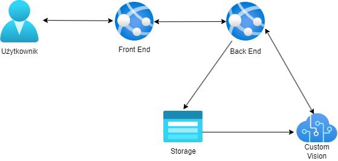

# HADaR
Projekt S zrealizowany w ramach przedmiotu Wprowadzenie do aplikacji i rozwiązań opartych o Sztuczną Inteligencję i Microsoft Azure.
## Zespół:
- Paweł Tęcza - GitHub: [link](https://github.com/p-tecza)
- Tomasz Gryczka - GitHub: [link](https://github.com/TomaszGryczka)
- Krzysztof Romański - GitHub: [link](https://github.com/spykur)
## Opis projektu
Projekt zakłada rozpoznawanie czynności, wykonywanych przez ludzi, uchwyconych na zdjęciach zrobionych przez kamery monitorujące sale lokali użytkowych
(typu kluby lub sale konferencyjne). Po wykryciu odpowiednich czynności, wykonywane jest zestawienie przedstawiające w jakich godzinach, największa liczba
liczbu wykonuje wybrane czynności. W zależności od wymagań użytkownika możliwe jest sprawdzanie takich czynności jak jedzenie, picie, tańczenie. Dzięki takim 
informacjom użytkownicy mogą podjąć decyzję w jakich godzinach statystycznie potrzebna jest większa obsługa lokalu lub skupienie pracowników na poszczególnych usługach.
## Diagram

## Opis funkcjonalności
- Przed pierwszym użyciem programu należy go przetrenować na danych dostosowanych do użytkownika
  - Użytkownik dostarcza nagrania lub zdjęcia z monitoringu lokalu dla którego później będzie on używać programu
  - Należy wyznaczyć ręcznie grupę zdjęć dla wszystkich czynności których analiza interesuje klienta
  - Należy przetrenować algorytm dla wszystkich aktywności
- Po przetrenowaniu modelu użytkownik może dowolną liczbę razy używać programu w podany poniżej sposób
  - Użytkownik wchodzi na stronę [link](https://hadar-statistics.azurewebsites.net/)
  - Użytkownik wybiera zdjęcie które chce przenalizować, wybiera godzinę wykonania zdjęcia, klika guzik submit (powtarza dla wszystkich posiadanych zdjęć)
  - Użytkownik otrzymuje wykresy pokazujące jaki procent wszystkich wykonywanych czynności w każdej godzinie stanowi poszczególna czynność
## Stos technologiczny
- Java
- Spring Boot
- Angular
- Microsoft Azure
- Bootstrap
